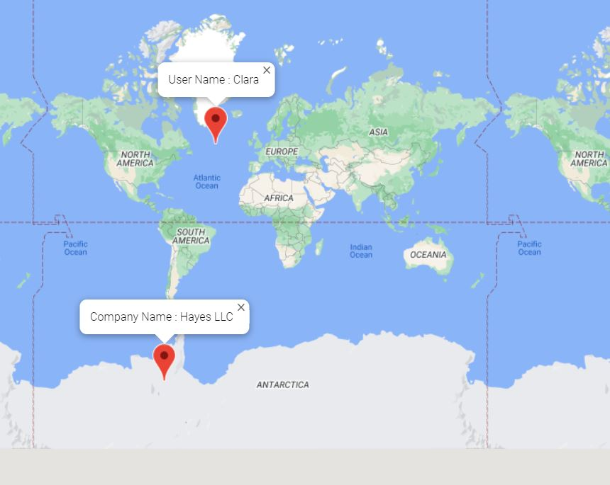

# MapsApp using TypeScript 

## Description 
#### The maps app take displays the marker of USER and Company on Google Maps using google maps api.This app can be integrated in any existing application and can be implemented as interface. 

### Tech Stack 
- typescript  :For creating Backend Services
- googlemapsApi
- Faker Api - Used to create fake location and details for user and company. 

### Usage 
The app consist of 3 independent module ( USER , COMPANY , Custom Map). Custom map can be modified to get more features out of the maps api.
App can be used in any existing application and can be implemented as interface and can be scaled easily for more than USER and COMPANY.

